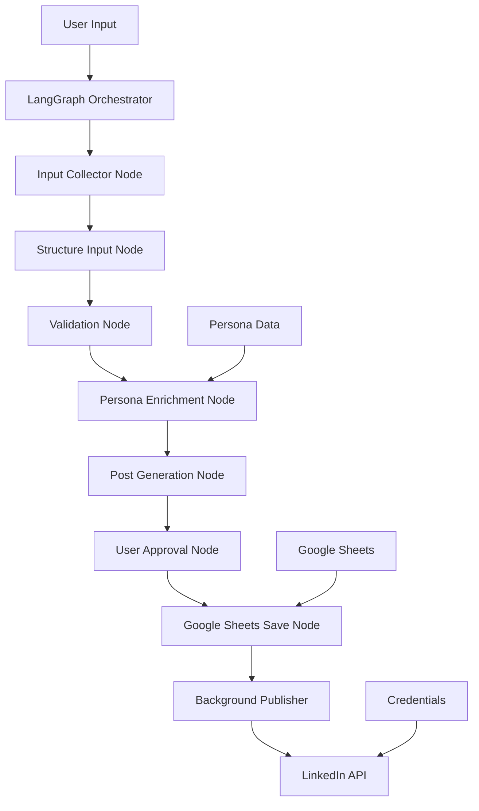

# 🚀 Automatic LinkedIn Poster

<div align="center">

**An intelligent AI-powered system for creating and scheduling authentic LinkedIn posts**

*Transform rough notes into polished, engaging LinkedIn content while maintaining your unique professional voice*

[](https://www.python.org/downloads/)
[](https://python.langchain.com/)
[](https://ai.google.dev/)
[](#license)

</div>

---

## 📖 Table of Contents

- [🌟 Overview](#-overview)
- [✨ Key Features](#-key-features)
- [🏗️ Architecture](#️-architecture)
- [📋 Prerequisites](#-prerequisites)
- [🛠️ Installation](#️-installation)
- [⚙️ Configuration](#️-configuration)
- [🎯 Usage Guide](#-usage-guide)
- [📁 Project Structure](#-project-structure)
- [🔄 Workflow Details](#-workflow-details)
- [🎨 Persona Customization](#-persona-customization)
- [📊 Google Sheets Integration](#-google-sheets-integration)
- [🔐 Security & Best Practices](#-security--best-practices)
- [🔧 Troubleshooting](#-troubleshooting)
- [🚀 Advanced Usage](#-advanced-usage)
- [📈 Performance Tips](#-performance-tips)
- [🤝 Contributing](#-contributing)
- [📄 License](#-license)

---

## 🌟 Overview

The **Automatic LinkedIn Poster** is a sophisticated content creation system that leverages advanced AI technology to help professionals maintain an active, authentic LinkedIn presence. Built with **LangGraph** and **Google's Gemini Flash**, it transforms rough ideas into polished, engaging posts that reflect your unique professional voice.

### 🎯 **Perfect For:**
- **Busy Professionals** who want to maintain LinkedIn presence
- **Content Creators** looking to streamline their workflow
- **Thought Leaders** who want consistent, quality content
- **Career-focused individuals** building their professional brand
- **Teams** managing multiple LinkedIn accounts

### 🧠 **How It's Different:**
- **Multi-stage AI refinement** ensures high-quality output
- **Persona-driven content** maintains your authentic voice
- **Interactive approval process** with intelligent revision handling
- **Structured workflow** from rough notes to published posts
- **Google Sheets integration** for seamless scheduling

---

## ✨ Key Features

### 🤖 **AI-Powered Content Generation**
- **Multi-Stage LLM Pipeline**: 4-stage refinement process using Google Gemini Flash
- **Intelligent Structuring**: Converts rough notes into organized, coherent posts
- **Content Validation**: Automatically identifies missing information and asks clarifying questions
- **Style Adaptation**: Maintains your unique voice across all posts

### 🎨 **Persona-Driven Writing**
- **Professional Voice Consistency**: Uses detailed persona profiles
- **Tone Customization**: Adapts writing style to match your preferences
- **Career Alignment**: Connects content to your professional goals
- **Industry Focus**: Tailors content to your specific field and audience

### ⏰ **Smart Scheduling & Automation**
- **Flexible Scheduling**: Immediate posting or future scheduling
- **Google Sheets Integration**: Centralized post management
- **Automated Publishing**: Background service for hands-off posting
- **Post Tracking**: Complete audit trail of all content

### 📝 **Interactive Workflow**
- **User-Friendly Interface**: Step-by-step guided process
- **Real-Time Feedback**: Live updates during content generation
- **Revision System**: Intelligent post improvement based on feedback
- **Approval Process**: Full control over what gets published

### 📊 **Content Intelligence**
- **Post Categorization**: Automatically identifies content type
- **Engagement Optimization**: Suggests questions and calls-to-action
- **Hashtag Management**: Smart hashtag selection and placement
- **Media Integration**: Support for images and documents

---

## 🏗️ Architecture

### **System Components:**



### **Technology Stack:**

| Component | Technology | Purpose |
|-----------|------------|----------|
| **Workflow Engine** | LangGraph | Orchestrates multi-stage AI pipeline |
| **AI Model** | Google Gemini Flash | Content generation and refinement |
| **State Management** | Pydantic TypedDict | Type-safe data flow between nodes |
| **Storage** | Google Sheets API | Post scheduling and tracking |
| **Authentication** | LinkedIn OAuth 2.0 | Secure API access |
| **Configuration** | JSON + Environment Variables | Secure credential management |

---

## 📋 Prerequisites

### **Required Accounts & Services:**

#### 1. **LinkedIn Developer Account**
```
✅ LinkedIn account with posting permissions
✅ OAuth 2.0 application with 'w_member_social' scope
✅ Valid access token (renewable)
```

#### 2. **Google Cloud Platform Account**
```
✅ GCP project with billing enabled
✅ Service Account with JSON key file
✅ Google Sheets API enabled
✅ Google AI Studio API key (for Gemini)
```

#### 3. **Google Workspace**
```
✅ Google Spreadsheet for post management
✅ Service account email granted editor access
✅ Spreadsheet ID from URL
```

### **System Requirements:**
```
✅ Python 3.8 or higher
✅ Internet connection for API calls
✅ 500MB+ free disk space
✅ Windows, macOS, or Linux
```

---

## 🛠️ Installation

### **Method 1: Quick Setup (Recommended)**

```bash
# Clone the repository
git clone https://github.com/your-username/automatic-linkedin-poster.git
cd automatic-linkedin-poster

# Create virtual environment (recommended)
python -m venv .venv

# Activate virtual environment
# Windows:
.venv\Scripts\activate
# macOS/Linux:
source .venv/bin/activate

# Install dependencies
pip install -r requirements.txt
```

### **Method 2: Development Setup**

```bash
# Clone with development dependencies
git clone https://github.com/your-username/automatic-linkedin-poster.git
cd automatic-linkedin-poster

# Create development environment
python -m venv .venv --upgrade-deps
source .venv/bin/activate  # or .venv\Scripts\activate on Windows

# Install with development dependencies
pip install -r requirements.txt
pip install -r requirements-dev.txt  # If available
```

### **Verify Installation**

```bash
# Check Python version
python --version

# Verify key dependencies
python -c "import langchain, langgraph, google.generativeai; print('✅ All dependencies installed')"
```

---

## ⚙️ Configuration

### **Step 1: Environment Variables**

Create or update your `.env` file:

```bash
# Required: Google AI Studio API Key
GOOGLE_API_KEY=your_google_ai_studio_api_key_here

# Optional: LangSmith Tracing (for debugging)
LANGSMITH_TRACING=true
LANGSMITH_API_KEY=your_langsmith_api_key
LANGSMITH_PROJECT="LinkedIn Poster"
```

### **Step 2: Create Your Persona File**

```bash
# Copy the template from sample_user_info folder
cp sample_user_info/sample_persona.json user_info/persona.json

# Edit with your details
nano user_info/persona.json  # or use your preferred editor
```

**Example Persona Structure:**
```json
{
  "name": "Your Full Name",
  "age": 28,
  "location": "Your Location",
  
  "background": {
    "education": [
      {
        "degree": "MS in Computer Science",
        "institution": "University Name",
        "year": "2022"
      }
    ],
    "current_role": "Your Job Title",
    "years_experience": 5,
    "previous_roles": [
      "Previous Job Title at Company"
    ]
  },
  
  "skills": [
    "Python", "Machine Learning", "Cloud Architecture"
  ],
  
  "tone": {
    "style": "professional yet approachable",
    "characteristics": ["inspirational", "humble", "educational"]
  },
  
  "content_preferences": {
    "hashtag_usage": "3-5 relevant hashtags per post",
    "emoji_usage": "Sparingly, for emphasis"
  }
}
```

### **Step 3: Run Setup Wizard**

**Option A: Command Line Setup (Traditional)**
```bash
python setup.py
```

**Option B: Web-Based Setup (Gradio Interface)**
```bash
python setup_gradio.py
```
This opens a user-friendly web interface in your browser for easier configuration.

The interactive setup will guide you through:

1. **LinkedIn Configuration**
   - Enter your LinkedIn access token
   - Validate token permissions
   - Fetch your LinkedIn Person URN

2. **Google Sheets Setup**
   - Provide spreadsheet ID
   - Set sheet name (default: "Posts")
   - Configure service account authentication

3. **Persona Integration**
   - Link your persona.json file
   - Validate persona structure

4. **Final Validation**
   - Test all connections
   - Create credentials.json
   - Confirm setup success

---

## 🎯 Usage Guide

### **Creating Your First Post**

```bash
python main.py
```

#### **Interactive Workflow:**

1. **📝 Input Collection**
   ```
   Tell me about what you want to share on LinkedIn.
   This can be rough notes, bullet points, or a brief description.
   (Type 'END' on a new line when finished)
   
   > Just finished implementing a new ML model that improved
   > our prediction accuracy by 23%. Used TensorFlow and deployed
   > on AWS. Took 3 weeks, learned a lot about hyperparameter tuning.
   > END
   ```

2. **📎 Attachments (Optional)**
   ```
   Do you have any images or documents to attach?
   Enter 'yes' or 'no': yes
   
   Enter file paths (one per line, type 'DONE' when finished):
   > /path/to/model_results.png
   > DONE
   ```

3. **⏰ Scheduling**
   ```
   When should this post be published?
   Format: YYYY-MM-DD HH:MM (24-hour format)
   (Press Enter to post immediately)
   
   > 2025-08-20 09:00
   ```

4. **🤖 AI Processing** (Automatic)
   - Structures your input into organized data
   - Validates completeness
   - Enriches with your persona
   - Generates polished LinkedIn post

5. **👀 Review & Approval**
   ```
   Here's your generated LinkedIn post:
   
   [Generated post content]
   
   Review Options:
   1. Approve - Post looks great, schedule it!
   2. Revise - I'd like to make some changes
   3. Regenerate - Start over with a completely new version
   4. Cancel - Exit without saving
   ```

6. **💾 Automatic Saving**
   - Saves to Google Sheets
   - Generates tracking number
   - Provides confirmation

### **Advanced Usage Examples**

#### **Batch Content Creation**
```bash
# Create multiple posts in sequence
for i in {1..5}; do
    echo "Creating post $i..."
    python main.py
    echo "Post $i completed"
done
```

#### **Scheduled Content Pipeline**
```bash
# Morning routine: Create posts for the week
python main.py  # Monday post
python main.py  # Wednesday post  
python main.py  # Friday post
```

---

## 📁 Project Structure

```
AUTOMATIC-LINKEDIN-POSTER/
│
├── 📱 Core Application
│   ├── main.py                 # Main workflow orchestrator
│   ├── setup.py               # CLI configuration wizard
│   ├── setup_gradio.py        # Web-based setup interface
│   ├── state.py               # Workflow state definitions
│   ├── backgrounds.py         # Auto-posting service
│   └── credentials_loader.py  # Credential management utilities
│
├── 🧩 Workflow Nodes
│   └── nodes/
│       ├── input_collector.py      # Stage 0: User input collection
│       ├── structure_input.py      # Stage 1: Convert to structured data
│       ├── validate_completeness.py # Stage 2: Validation & questions
│       ├── enrich_persona.py       # Stage 3: Persona integration
│       ├── generate_post.py        # Stage 4: Initial post generation
│       ├── refine_post.py          # Stage 5: Humanization & refinement
│       ├── user_approval.py        # User review & revision handling
│       ├── save_to_sheet.py        # Google Sheets integration
│       └── update_persona.py       # Stage 8: Persona auto-update
│
├── ⚙️ Configuration Templates
│   └── sample_user_info/
│       ├── sample_credentials.json # Template credentials file
│       ├── sample_persona.json    # Template persona file
│       └── sample_service_file.json # Template service account
│
├── 👤 User Configuration
│   └── user_info/              # Created during setup
│       ├── credentials.json   # Your API credentials
│       ├── persona.json      # Your persona file
│       └── service_account.json # Google service account
│
├── 📝 Documentation & Dependencies
│   ├── README.md             # This comprehensive guide
│   ├── requirements.txt      # Python dependencies
│   ├── .env                 # Environment variables
│   └── .gitignore          # Git ignore rules
│
└── 🔧 Development
    └── .venv/               # Virtual environment
```

### **File Descriptions:**

| File | Purpose | Auto-Generated |
|------|---------|----------------|
| `main.py` | Orchestrates the complete workflow using LangGraph | ❌ |
| `setup.py` | Interactive configuration wizard | ❌ |
| `state.py` | TypedDict definitions for workflow state management | ❌ |
| `credentials.json` | Stores all API credentials and configuration | ✅ |
| `persona.json` | Your professional persona and writing preferences | ❌ |
| `.env` | Environment variables (API keys) | ❌ |

---

## 🔄 Workflow Details

### **9-Stage AI Pipeline:**

#### **Stage 0: Input Collection** 📝
```python
# Collects:
- Raw user notes/ideas
- Optional media attachments  
- Scheduling preferences
- Persona data loading
```

#### **Stage 1: Structure Input** 🏗️
```python
# AI Processing:
- Converts rough notes → structured JSON
- Identifies event type (project/achievement/learning)
- Extracts key details (tools, challenges, outcomes)
- Creates engagement hooks
```

#### **Stage 2: Validate Completeness** ✅
```python
# AI Validation:
- Checks for missing information
- Generates clarifying questions
- Ensures content completeness
- Validates story coherence
```

#### **Stage 3: Persona Enrichment** 🎨
```python
# Persona Integration:
- Applies your writing tone
- Adds relevant experience context
- Aligns with career goals
- Incorporates values and interests
```

#### **Stage 4: Post Generation** ✍️
```python
# Content Creation:
- Crafts initial LinkedIn post
- Follows professional structure
- Incorporates persona elements
- Creates baseline content
```

#### **Stage 5: Post Refinement & Humanization** ✨
```python
# Advanced Refinement:
- Humanizes the generated content
- Adds authentic emotions and vulnerability
- Enhances storytelling and engagement
- Optimizes hooks and call-to-actions
- Improves mobile readability
- Adds personal touches and relatability
```

#### **Stage 6: User Approval** 👀
```python
# Interactive Review:
- Presents refined content
- Handles revision requests
- Supports complete regeneration
- Tracks revision history
```

#### **Stage 7: Save & Schedule** 💾
```python
# Post Management:
- Saves to Google Sheets
- Assigns post number
- Sets scheduling timestamp
- Provides tracking URL
```

#### **Stage 8: Persona Auto-Update** 📈
```python
# Self-Improving Intelligence:
- Analyzes your new activities and achievements
- Extracts professional growth information
- Updates skills, experiences, achievements
- Maintains persona currency and accuracy
- Creates automatic backups before changes
- Learns continuously from your posts
```

### **Error Handling & Recovery:**

```python
# Robust Error Management:
- API failure recovery
- Invalid input handling
- Network timeout management
- Graceful degradation
- Detailed error reporting
```

---

## 🎨 Persona Customization

### **Complete Persona Structure:**

```json
{
  "basic_info": {
    "full_name": "Your Full Name",
    "current_role": "Senior Software Engineer",
    "industry": "Technology",
    "location": "San Francisco, CA",
    "years_experience": 8
  },
  
  "background": {
    "education": [
      {
        "degree": "MS Computer Science",
        "institution": "Stanford University",
        "year": "2020",
        "specialization": "Machine Learning"
      }
    ],
    "experience": [
      {
        "role": "Senior SWE",
        "company": "Tech Corp",
        "duration": "3 years",
        "achievements": ["Led ML platform development"]
      }
    ]
  },
  
  "skills_expertise": {
    "technical_skills": ["Python", "TensorFlow", "AWS", "Kubernetes"],
    "soft_skills": ["Team Leadership", "Mentoring", "Public Speaking"],
    "certifications": ["AWS Solutions Architect", "PMP"]
  },
  
  "communication_preferences": {
    "tone": "professional yet approachable",
    "style": "conversational with technical depth",
    "use_emojis": true,
    "emoji_frequency": "moderate",
    "use_hashtags": true,
    "hashtag_style": "3-5 relevant professional hashtags",
    "preferred_post_length": "150-250 words"
  },
  
  "content_preferences": {
    "topics_of_interest": [
      "Machine Learning",
      "Software Architecture", 
      "Team Leadership",
      "Tech Industry Trends"
    ],
    "engagement_style": "Ask thoughtful questions",
    "sharing_frequency": "2-3 times per week",
    "content_types": [
      "Technical insights",
      "Career reflections",
      "Industry commentary",
      "Project showcases"
    ]
  },
  
  "professional_goals": {
    "short_term": "Lead architecture decisions for ML platform",
    "long_term": "Become CTO at a tech company",
    "values": ["Innovation", "Mentorship", "Continuous Learning"]
  },
  
  "network_context": {
    "target_audience": [
      "Software Engineers",
      "Tech Leaders",
      "ML Engineers",
      "Startup Founders"
    ],
    "industry_communities": [
      "ML Engineering",
      "Tech Leadership",
      "Open Source"
    ]
  }
}
```

### **Persona Impact on Content:**

| Persona Element | Content Impact | Example |
|----------------|----------------|---------|
| **Tone** | Writing style adaptation | "Excited to share..." vs "I'd like to discuss..." |
| **Technical Skills** | Relevant hashtags/topics | #MachineLearning #Python #AWS |
| **Career Goals** | Content alignment | Leadership insights for CTO aspirations |
| **Values** | Message emphasis | Mentorship mentions, learning focus |
| **Audience** | Language complexity | Technical depth for engineer audience |

---

## 📊 Google Sheets Integration

### **Sheet Structure:**

| Column | Purpose | Format | Auto-Filled |
|--------|---------|--------|-------------|
| `post_number` | Sequential ID | Integer | ✅ |
| `post` | LinkedIn post content | Text | ✅ |
| `attachments` | Media file paths | Comma-separated | ✅ |
| `to_be_posted_at` | Scheduled time | YYYY-MM-DD HH:MM | ✅ |
| `posted_at` | Actual post time | YYYY-MM-DD HH:MM:SS | 🔄 Background Service |
| `status` | Post status | draft/scheduled/posted | 🔄 Background Service |
| `engagement` | Likes/comments/shares | JSON object | 🔄 Background Service |

### **Sample Sheet Data:**

```
| post_number | post | attachments | to_be_posted_at | posted_at | status |
|-------------|------|-------------|-----------------|-----------|--------|
| 1 | "Excited to share..." | image1.png | 2025-08-20 09:00 | | scheduled |
| 2 | "Just completed..." | | 2025-08-21 14:30 | | scheduled |
| 3 | "Reflecting on..." | doc1.pdf | 2025-08-20 08:45 | 2025-08-20 08:45:23 | posted |
```

### **Advanced Sheet Features:**

#### **Conditional Formatting:**
```
✅ Green: Posted successfully
🟡 Yellow: Scheduled for posting  
🔴 Red: Failed to post
⚪ Gray: Draft status
```

#### **Data Validation:**
```
- Date format validation
- Post length warnings
- Attachment path verification
- Status field restrictions
```

#### **Formulas & Analytics:**
```
- Post frequency analysis
- Engagement rate calculations
- Content type distribution
- Optimal posting time insights
```

### **Sheet Management Commands:**

```bash
# View current posts
python -c "from nodes.save_to_sheet import view_scheduled_posts; view_scheduled_posts()"

# Clear old posts (optional)
python -c "from nodes.save_to_sheet import archive_old_posts; archive_old_posts(days=30)"
```

---

## 🔐 Security & Best Practices

### **Credential Management:**

#### **Environment Variables (.env):**
```bash
# ✅ GOOD: Use environment variables for API keys
GOOGLE_API_KEY=your_key_here

# ❌ BAD: Never hardcode in source files
# api_key = "hardcoded_key_here"  # DON'T DO THIS
```

#### **File Permissions:**
```bash
# Set restrictive permissions on sensitive files
chmod 600 credentials.json
chmod 600 .env
chmod 600 *.json  # All JSON files with potential secrets
```

#### **Git Security:**
```gitignore
# Essential .gitignore entries
credentials.json
.env
*.json
!persona_sample.json
!package.json
__pycache__/
.venv/
*.log
```

### **API Security:**

#### **LinkedIn Token Management:**
```python
# ✅ Token rotation strategy
- Rotate tokens every 30-60 days
- Monitor token expiration
- Use refresh tokens when possible
- Implement token validation checks
```

#### **Google Cloud Security:**
```python
# ✅ Service Account Best Practices
- Use service accounts (not personal accounts)
- Grant minimal required permissions
- Regularly audit service account access
- Enable audit logging
```

### **Data Privacy:**

```python
# ✅ Content Security
- Never log sensitive post content
- Implement local content encryption
- Regular credential rotation
- Secure backup strategies
```

### **Network Security:**

```bash
# ✅ HTTPS Everywhere
- All API calls use HTTPS
- Certificate validation enabled
- Timeout configurations set
- Retry logic with exponential backoff
```

---

## 🔧 Troubleshooting

### **Common Issues & Solutions:**

#### **🔑 Authentication Issues**

**Problem:** LinkedIn token invalid
```bash
Error: LinkedIn authentication failed
```

**Solutions:**
1. Check token expiration date
2. Verify token scopes include `w_member_social`
3. Regenerate token in LinkedIn Developer Console
4. Update `credentials.json` with new token

**Problem:** Google Sheets access denied
```bash
Error: The caller does not have permission
```

**Solutions:**
1. Share spreadsheet with service account email
2. Grant "Editor" permissions (not "Viewer")
3. Verify service account JSON file is valid
4. Check Google Sheets API is enabled

#### **🤖 AI/LLM Issues**

**Problem:** Gemini API rate limit exceeded
```bash
Error: Rate limit exceeded for Gemini Flash
```

**Solutions:**
1. Wait and retry (automatic exponential backoff)
2. Check your Google AI Studio quota
3. Consider upgrading to paid tier
4. Implement request queuing

**Problem:** Poor content quality
```bash
Generated content doesn't match my style
```

**Solutions:**
1. Update persona.json with more specific preferences
2. Add examples of your preferred writing style
3. Use the revision feature with specific feedback
4. Adjust temperature settings in generate_post.py

#### **📊 Google Sheets Issues**

**Problem:** Sheet not found or inaccessible
```bash
Error: Unable to access spreadsheet
```

**Solutions:**
1. Verify spreadsheet ID in credentials.json
2. Check sheet name spelling (case-sensitive)
3. Ensure spreadsheet isn't deleted
4. Confirm service account has access

**Problem:** Data formatting issues
```bash
Error: Invalid date format in to_be_posted_at
```

**Solutions:**
1. Use format: YYYY-MM-DD HH:MM
2. Check system timezone settings
3. Validate date input during collection
4. Update date parsing in save_to_sheet.py

### **Debug Mode:**

```bash
# Enable verbose logging
export LANGSMITH_TRACING=true
python main.py

# Check system health
python -c "from setup import LinkedInSetup; LinkedInSetup.test_connection()"

# Validate configuration
python setup.py --validate-only
```

### **Log Analysis:**

```bash
# View recent errors
tail -f logs/linkedin_poster.log

# Search for specific issues
grep "ERROR" logs/*.log

# Monitor API calls
grep "API_CALL" logs/*.log | tail -20
```

---

## 🚀 Advanced Usage

### **Custom Workflow Modifications:**

#### **Adding Custom Validation:**
```python
# Create custom validation node
def custom_content_validator(state: WorkflowState) -> WorkflowState:
    post_content = state.get('draft_post', '')
    
    # Custom validation rules
    if len(post_content) > 3000:
        state['error'] = "Post too long for LinkedIn"
        return state
    
    if not any(tag in post_content for tag in ['#', '@']):
        state['validation_warnings'] = ["Consider adding hashtags or mentions"]
    
    return state
```

#### **Custom Persona Logic:**
```python
# Add industry-specific customization
def tech_industry_enhancer(state: WorkflowState) -> WorkflowState:
    if state['persona_data']['industry'] == 'Technology':
        # Add tech-specific enhancements
        state['tech_enhancements'] = {
            'include_github_links': True,
            'technical_depth': 'moderate',
            'use_tech_hashtags': True
        }
    return state
```

### **Batch Processing:**

```python
# Process multiple posts from CSV
import pandas as pd

def batch_create_posts(csv_file: str):
    df = pd.read_csv(csv_file)
    
    for _, row in df.iterrows():
        initial_state = WorkflowState()
        initial_state['raw_input'] = row['content']
        initial_state['scheduled_time'] = row['schedule']
        
        # Process through workflow
        result = workflow.invoke(initial_state)
        print(f"Processed: {row['title']}")
```

### **Content Templates:**

```python
# Define reusable content templates
TEMPLATES = {
    'project_showcase': {
        'structure': '🚀 Project → 🔧 Technology → 💡 Learning → 🤝 Team',
        'tone': 'excited_professional',
        'hashtags': ['#TechProject', '#Learning', '#Development']
    },
    'career_milestone': {
        'structure': '🎉 Achievement → 🧠 Reflection → 🙏 Gratitude → 🔮 Future',
        'tone': 'humble_grateful', 
        'hashtags': ['#CareerGrowth', '#Milestone', '#Grateful']
    }
}
```

### **Analytics & Monitoring:**

```python
# Track content performance
def analyze_post_performance():
    posts = load_posts_from_sheet()
    
    metrics = {
        'total_posts': len(posts),
        'avg_length': sum(len(p['content']) for p in posts) / len(posts),
        'most_common_hashtags': extract_hashtag_frequency(posts),
        'posting_patterns': analyze_timing_patterns(posts)
    }
    
    return metrics
```

---

## 📈 Performance Tips

### **Optimization Strategies:**

#### **1. API Efficiency**
```python
# ✅ Implement request batching
- Batch Google Sheets operations
- Use connection pooling for HTTP requests
- Cache frequently accessed data
- Implement intelligent retry logic
```

#### **2. Content Quality**
```python
# ✅ Enhance AI prompts
- Use specific, detailed prompts
- Include examples in system messages
- Implement few-shot learning
- Fine-tune temperature settings
```

#### **3. Workflow Speed**
```python
# ✅ Parallel processing where possible
- Async API calls
- Concurrent validation steps
- Background file processing
- Preload persona data
```

### **Resource Management:**

```python
# Monitor resource usage
def monitor_usage():
    return {
        'api_calls_remaining': check_rate_limits(),
        'memory_usage': get_memory_stats(),
        'processing_time': track_execution_time(),
        'success_rate': calculate_success_rate()
    }
```

### **Cost Optimization:**

| Service | Cost Factor | Optimization |
|---------|-------------|-------------|
| **Gemini API** | Token usage | Optimize prompt length, use Flash model |
| **Google Sheets** | API calls | Batch operations, cache reads |
| **LinkedIn API** | Rate limits | Intelligent queuing, retry logic |
| **Compute** | Processing time | Async operations, efficient algorithms |

---

## 🤝 Contributing

We welcome contributions to make the Automatic LinkedIn Poster even better!

### **Ways to Contribute:**

- 🐛 **Bug Reports**: Found an issue? Please open an issue with detailed reproduction steps
- 💡 **Feature Requests**: Have an idea? We'd love to hear about it
- 📝 **Documentation**: Help improve our guides and examples
- 🔧 **Code**: Submit pull requests for bug fixes or new features
- 🧪 **Testing**: Help test new features and report compatibility issues

### **Development Setup:**

```bash
# Fork the repository
git fork https://github.com/your-username/automatic-linkedin-poster

# Clone your fork
git clone https://github.com/your-username/automatic-linkedin-poster
cd automatic-linkedin-poster

# Create feature branch
git checkout -b feature/amazing-new-feature

# Install development dependencies
pip install -r requirements-dev.txt

# Run tests
pytest tests/

# Submit pull request
git push origin feature/amazing-new-feature
```

### **Code Style:**
```bash
# Format code
black .

# Check linting
flake8 .

# Type checking
mypy .
```

### **Testing:**
```bash
# Run all tests
pytest

# Run specific test category
pytest tests/unit/
pytest tests/integration/

# Run with coverage
pytest --cov=. --cov-report=html
```

---

## 📄 License

```
MIT License

Copyright (c) 2025 Automatic LinkedIn Poster

Permission is hereby granted, free of charge, to any person obtaining a copy
of this software and associated documentation files (the "Software"), to deal
in the Software without restriction, including without limitation the rights
to use, copy, modify, merge, publish, distribute, sublicense, and/or sell
copies of the Software, and to permit persons to whom the Software is
furnished to do so, subject to the following conditions:

The above copyright notice and this permission notice shall be included in all
copies or substantial portions of the Software.

THE SOFTWARE IS PROVIDED "AS IS", WITHOUT WARRANTY OF ANY KIND, EXPRESS OR
IMPLIED, INCLUDING BUT NOT LIMITED TO THE WARRANTIES OF MERCHANTABILITY,
FITNESS FOR A PARTICULAR PURPOSE AND NONINFRINGEMENT. IN NO EVENT SHALL THE
AUTHORS OR COPYRIGHT HOLDERS BE LIABLE FOR ANY CLAIM, DAMAGES OR OTHER
LIABILITY, WHETHER IN AN ACTION OF CONTRACT, TORT OR OTHERWISE, ARISING FROM,
OUT OF OR IN CONNECTION WITH THE SOFTWARE OR THE USE OR OTHER DEALINGS IN THE
SOFTWARE.
```

---

## 📞 Support & Community

### **Get Help:**
- 📖 **Documentation**: This comprehensive README
- 🐛 **Issues**: [GitHub Issues](https://github.com/your-username/automatic-linkedin-poster/issues)
- 💬 **Discussions**: [GitHub Discussions](https://github.com/your-username/automatic-linkedin-poster/discussions)
- 📧 **Email**: support@automatic-linkedin-poster.com

### **Stay Updated:**
- ⭐ **Star this repository** to show support
- 👁️ **Watch** for release notifications
- 🍴 **Fork** to customize for your needs

### **Community:**
- Join our [Discord Server](https://discord.gg/linkedin-poster) for real-time help
- Follow us on [LinkedIn](https://linkedin.com/company/automatic-linkedin-poster)
- Subscribe to our [Newsletter](https://newsletter.automatic-linkedin-poster.com)

---

<div align="center">

**Made with ❤️ by developers, for developers**

*Transform your LinkedIn presence with AI-powered content creation*

[](https://github.com/your-username/automatic-linkedin-poster)
[](https://linkedin.com/company/automatic-linkedin-poster)
[](https://twitter.com/linkedin_poster)

</div>
