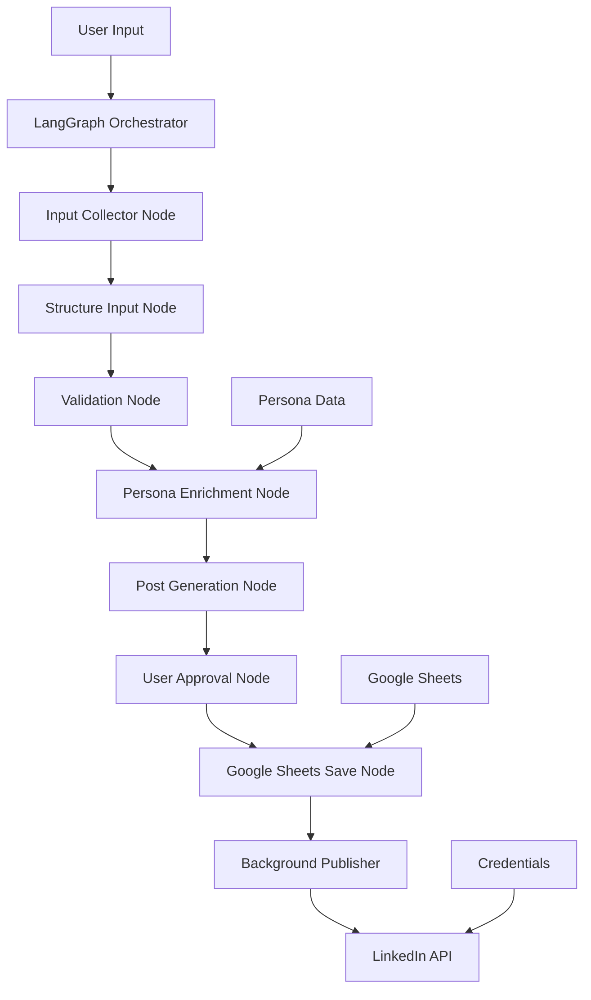

# 🚀 Automatic LinkedIn Poster

<div align="center">

**An intelligent AI-powered system for creating and scheduling authentic LinkedIn posts**

*Transform rough notes into polished, engaging LinkedIn content while maintaining your unique professional voice*

[](https://www.python.org/downloads/)
[](https://python.langchain.com/)
[](https://ai.google.dev/)
[](#license)

</div>

---

## 📖 Table of Contents

- [🌟 Overview](#-overview)
- [✨ Key Features](#-key-features)
- [🏗️ Architecture](#️-architecture)
- [📋 Prerequisites](#-prerequisites)
- [🛠️ Installation](#️-installation)
- [⚙️ Configuration](#️-configuration)
- [🎯 Usage Guide](#-usage-guide)
- [📁 Project Structure](#-project-structure)
- [🔄 Workflow Details](#-workflow-details)
- [🎨 Persona Customization](#-persona-customization)
- [📊 Google Sheets Integration](#-google-sheets-integration)
- [🤝 Contributing](#-contributing)
- [📄 License](#-license)

---

## 🌟 Overview

The **Automatic LinkedIn Poster** is a sophisticated content creation system that leverages advanced AI technology to help professionals maintain an active, authentic LinkedIn presence. Built with **LangGraph** and **Google's Gemini Flash**, it transforms rough ideas into polished, engaging posts that reflect your unique professional voice.

### 🎯 **Perfect For:**
- **Busy Professionals** who want to maintain LinkedIn presence
- **Content Creators** looking to streamline their workflow
- **Thought Leaders** who want consistent, quality content
- **Career-focused individuals** building their professional brand
- **Teams** managing multiple LinkedIn accounts

### 🧠 **How It's Different:**
- **Multi-stage AI refinement** ensures high-quality output
- **Persona-driven content** maintains your authentic voice
- **Interactive approval process** with intelligent revision handling
- **Structured workflow** from rough notes to published posts
- **Google Sheets integration** for seamless scheduling

---

## ✨ Key Features

### 🤖 **AI-Powered Content Generation**
- **Multi-Stage LLM Pipeline**: 4-stage refinement process using Google Gemini Flash
- **Intelligent Structuring**: Converts rough notes into organized, coherent posts
- **Content Validation**: Automatically identifies missing information and asks clarifying questions
- **Style Adaptation**: Maintains your unique voice across all posts

### 🎨 **Persona-Driven Writing**
- **Professional Voice Consistency**: Uses detailed persona profiles
- **Tone Customization**: Adapts writing style to match your preferences
- **Career Alignment**: Connects content to your professional goals
- **Industry Focus**: Tailors content to your specific field and audience

### ⏰ **Smart Scheduling & Automation**
- **Flexible Scheduling**: Immediate posting or future scheduling
- **Google Sheets Integration**: Centralized post management
- **Automated Publishing**: Background service for hands-off posting
- **Post Tracking**: Complete audit trail of all content

### 📝 **Interactive Workflow**
- **User-Friendly Interface**: Step-by-step guided process
- **Real-Time Feedback**: Live updates during content generation
- **Revision System**: Intelligent post improvement based on feedback
- **Approval Process**: Full control over what gets published

### 📊 **Content Intelligence**
- **Post Categorization**: Automatically identifies content type
- **Engagement Optimization**: Suggests questions and calls-to-action
- **Hashtag Management**: Smart hashtag selection and placement
- **Media Integration**: Support for images and documents

---

## 🏗️ Architecture

### **System Components:**



### **Technology Stack:**

| Component | Technology | Purpose |
|-----------|------------|----------|
| **Workflow Engine** | LangGraph | Orchestrates multi-stage AI pipeline |
| **AI Model** | Google Gemini Flash | Content generation and refinement |
| **State Management** | Pydantic TypedDict | Type-safe data flow between nodes |
| **Storage** | Google Sheets API | Post scheduling and tracking |
| **Authentication** | LinkedIn OAuth 2.0 | Secure API access |
| **Configuration** | JSON + Environment Variables | Secure credential management |

---

## 📋 Prerequisites

### **Required Accounts & Services:**

#### 1. **LinkedIn Developer Account**
```
✅ LinkedIn account with posting permissions
✅ OAuth 2.0 application with 'w_member_social' scope
✅ Valid access token (renewable)
```

#### 2. **Google Cloud Platform Account**
```
✅ GCP project with billing enabled
✅ Service Account with JSON key file
✅ Google Sheets API enabled
✅ Google AI Studio API key (for Gemini)
```

#### 3. **Google Workspace**
```
✅ Google Spreadsheet for post management
✅ Service account email granted editor access
✅ Spreadsheet ID from URL
```

### **System Requirements:**
```
✅ Python 3.8 or higher
✅ Internet connection for API calls
✅ 500MB+ free disk space
✅ Windows, macOS, or Linux
```

---

## 🛠️ Installation

### **Method 1: Quick Setup (Recommended)**

```bash
# Clone the repository
git clone https://github.com/Tanish-Dhankhar/automatic-linkedin-poster.git
cd automatic-linkedin-poster

# Create virtual environment (recommended)
python -m venv .venv

# Activate virtual environment
# Windows:
.venv\Scripts\activate
# macOS/Linux:
source .venv/bin/activate

# Install dependencies
pip install -r requirements.txt
```

### **Method 2: Development Setup**

```bash
# Clone with development dependencies
git clone https://github.com/Tanish-Dhankhar/automatic-linkedin-poster.git
cd automatic-linkedin-poster

# Create development environment
python -m venv .venv --upgrade-deps
source .venv/bin/activate  # or .venv\Scripts\activate on Windows

# Install with development dependencies
pip install -r requirements.txt
pip install -r requirements-dev.txt  # If available
```

### **Verify Installation**

```bash
# Check Python version
python --version

# Verify key dependencies
python -c "import langchain, langgraph, google.generativeai; print('✅ All dependencies installed')"
```

---

## ⚙️ Configuration

### **Step 1: Environment Variables**

Create or update your `.env` file:

```bash
# Required: Google AI Studio API Key
GOOGLE_API_KEY=your_google_ai_studio_api_key_here

# Optional: LangSmith Tracing (for debugging)
LANGSMITH_TRACING=true
LANGSMITH_API_KEY=your_langsmith_api_key
LANGSMITH_PROJECT="LinkedIn Poster"
```

### **Step 2: Create Your Persona File**

```bash
# Copy the template from sample_user_info folder
cp sample_user_info/sample_persona.json user_info/persona.json

# Edit with your details
nano user_info/persona.json  # or use your preferred editor
```

**Example Persona Structure:**
```json
{
  "name": "Your Full Name",
  "age": 28,
  "location": "Your Location",
  
  "background": {
    "education": [
      {
        "degree": "MS in Computer Science",
        "institution": "University Name",
        "year": "2022"
      }
    ],
    "current_role": "Your Job Title",
    "years_experience": 5,
    "previous_roles": [
      "Previous Job Title at Company"
    ]
  },
  
  "skills": [
    "Python", "Machine Learning", "Cloud Architecture"
  ],
  
  "tone": {
    "style": "professional yet approachable",
    "characteristics": ["inspirational", "humble", "educational"]
  },
  
  "content_preferences": {
    "hashtag_usage": "3-5 relevant hashtags per post",
    "emoji_usage": "Sparingly, for emphasis"
  }
}
```

### **Step 3: Run Setup Wizard**

```bash
python setup.py
```

The interactive setup will guide you through:

1. **LinkedIn Configuration**
   - Enter your LinkedIn access token
   - Validate token permissions
   - Fetch your LinkedIn Person URN

2. **Google Sheets Setup**
   - Provide spreadsheet ID
   - Set sheet name (default: "Posts")
   - Configure service account authentication

3. **Persona Integration**
   - Link your persona.json file
   - Validate persona structure

4. **Final Validation**
   - Test all connections
   - Create credentials.json
   - Confirm setup success

---

## 🎯 Usage Guide

### **Creating Your First Post**

**Option A: Command Line Interface (CLI)**
```bash
python main.py
```

**Option B: Web Interface (Recommended)**
```bash
python app_gradio.py
```
This opens a user-friendly web interface in your browser at `http://localhost:7860` with an intuitive GUI for creating posts.

#### **Interactive Workflow:**

1. **📝 Input Collection**
   ```
   Tell me about what you want to share on LinkedIn.
   This can be rough notes, bullet points, or a brief description.
   (Type 'END' on a new line when finished)
   
   > Just finished implementing a new ML model that improved
   > our prediction accuracy by 23%. Used TensorFlow and deployed
   > on AWS. Took 3 weeks, learned a lot about hyperparameter tuning.
   > END
   ```

2. **📎 Attachments (Optional)**
   ```
   Do you have any images or documents to attach?
   Enter 'yes' or 'no': yes
   
   Enter file paths (one per line, type 'DONE' when finished):
   > /path/to/model_results.png
   > DONE
   ```

3. **⏰ Scheduling**
   ```
   When should this post be published?
   Format: YYYY-MM-DD HH:MM (24-hour format)
   (Press Enter to post immediately)
   
   > 2025-08-20 09:00
   ```

4. **🤖 AI Processing** (Automatic)
   - Structures your input into organized data
   - Validates completeness
   - Enriches with your persona
   - Generates polished LinkedIn post

5. **👀 Review & Approval**
   ```
   Here's your generated LinkedIn post:
   
   [Generated post content]
   
   Review Options:
   1. Approve - Post looks great, schedule it!
   2. Revise - I'd like to make some changes
   3. Regenerate - Start over with a completely new version
   4. Cancel - Exit without saving
   ```

6. **💾 Automatic Saving**
   - Saves to Google Sheets
   - Generates tracking number
   - Provides confirmation

### **Advanced Usage Examples**

#### **Batch Content Creation**
```bash
# Create multiple posts in sequence
for i in {1..5}; do
    echo "Creating post $i..."
    python main.py
    echo "Post $i completed"
done
```

#### **Scheduled Content Pipeline**
```bash
# Morning routine: Create posts for the week
python main.py  # Monday post
python main.py  # Wednesday post  
python main.py  # Friday post
```

---

## 📁 Project Structure

```
AUTOMATIC-LINKEDIN-POSTER/
│
├── 📱 Core Application
│   ├── main.py                 # Main workflow orchestrator
│   ├── setup.py               # CLI configuration wizard
│   ├── app_gradio.py          # Web-based interface for content creation
│   ├── state.py               # Workflow state definitions
│   ├── background.py          # Auto-posting service
│   └── credentials_loader.py  # Credential management utilities
│
├── 🧩 Workflow Nodes
│   └── nodes/
│       ├── input_collector.py      # Stage 0: User input collection
│       ├── structure_input.py      # Stage 1: Convert to structured data
│       ├── validate_completeness.py # Stage 2: Validation & questions
│       ├── enrich_persona.py       # Stage 3: Persona integration
│       ├── generate_post.py        # Stage 4: Initial post generation
│       ├── refine_post.py          # Stage 5: Humanization & refinement
│       ├── user_approval.py        # User review & revision handling
│       ├── save_to_sheet.py        # Google Sheets integration
│       ├── update_persona.py       # Stage 8: Persona auto-update
│       └── utils.py                # Utility functions and helpers
│
├── ⚙️ Configuration Templates
│   └── sample_user_info/
│       ├── sample_credentials.json # Template credentials file
│       ├── sample_persona.json    # Template persona file
│       └── sample_service_file.json # Template service account
│
├── 👤 User Configuration
│   └── user_info/              # Created during setup
│       ├── credentials.json   # Your API credentials
│       ├── persona.json      # Your persona file
│       └── service_account.json # Google service account
│
├── 📝 Documentation & Dependencies
│   ├── README.md             # This comprehensive guide
│   ├── requirements.txt      # Python dependencies
│   ├── .env                 # Environment variables
│   └── .gitignore          # Git ignore rules
│
└── 🔧 Development
    └── .venv/               # Virtual environment
```

### **File Descriptions:**

| File | Purpose | Auto-Generated |
|------|---------|----------------|
| `main.py` | Orchestrates the complete workflow using LangGraph | ❌ |
| `setup.py` | Interactive configuration wizard | ❌ |
| `state.py` | TypedDict definitions for workflow state management | ❌ |
| `credentials.json` | Stores all API credentials and configuration | ✅ |
| `persona.json` | Your professional persona and writing preferences | ❌ |
| `.env` | Environment variables (API keys) | ❌ |

---

## 🔄 Workflow Details

### **9-Stage AI Pipeline:**

#### **Stage 0: Input Collection** 📝
```python
# Collects:
- Raw user notes/ideas
- Optional media attachments  
- Scheduling preferences
- Persona data loading
```

#### **Stage 1: Structure Input** 🏗️
```python
# AI Processing:
- Converts rough notes → structured JSON
- Identifies event type (project/achievement/learning)
- Extracts key details (tools, challenges, outcomes)
- Creates engagement hooks
```

#### **Stage 2: Validate Completeness** ✅
```python
# AI Validation:
- Checks for missing information
- Generates clarifying questions
- Ensures content completeness
- Validates story coherence
```

#### **Stage 3: Persona Enrichment** 🎨
```python
# Persona Integration:
- Applies your writing tone
- Adds relevant experience context
- Aligns with career goals
- Incorporates values and interests
```

#### **Stage 4: Post Generation** ✍️
```python
# Content Creation:
- Crafts initial LinkedIn post
- Follows professional structure
- Incorporates persona elements
- Creates baseline content
```

#### **Stage 5: Post Refinement & Humanization** ✨
```python
# Advanced Refinement:
- Humanizes the generated content
- Adds authentic emotions and vulnerability
- Enhances storytelling and engagement
- Optimizes hooks and call-to-actions
- Improves mobile readability
- Adds personal touches and relatability
```

#### **Stage 6: User Approval** 👀
```python
# Interactive Review:
- Presents refined content
- Handles revision requests
- Supports complete regeneration
- Tracks revision history
```

#### **Stage 7: Save & Schedule** 💾
```python
# Post Management:
- Saves to Google Sheets
- Assigns post number
- Sets scheduling timestamp
- Provides tracking URL
```

#### **Stage 8: Persona Auto-Update** 📈
```python
# Self-Improving Intelligence:
- Analyzes your new activities and achievements
- Extracts professional growth information
- Updates skills, experiences, achievements
- Maintains persona currency and accuracy
- Creates automatic backups before changes
- Learns continuously from your posts
```

### **Error Handling & Recovery:**

```python
# Robust Error Management:
- API failure recovery
- Invalid input handling
- Network timeout management
- Graceful degradation
- Detailed error reporting
```

---

## 🎨 Persona Customization

### **Complete Persona Structure:**

```json
{
  "basic_info": {
    "full_name": "Your Full Name",
    "current_role": "Senior Software Engineer",
    "industry": "Technology",
    "location": "San Francisco, CA",
    "years_experience": 8
  },
  
  "background": {
    "education": [
      {
        "degree": "MS Computer Science",
        "institution": "Stanford University",
        "year": "2020",
        "specialization": "Machine Learning"
      }
    ],
    "experience": [
      {
        "role": "Senior SWE",
        "company": "Tech Corp",
        "duration": "3 years",
        "achievements": ["Led ML platform development"]
      }
    ]
  },
  
  "skills_expertise": {
    "technical_skills": ["Python", "TensorFlow", "AWS", "Kubernetes"],
    "soft_skills": ["Team Leadership", "Mentoring", "Public Speaking"],
    "certifications": ["AWS Solutions Architect", "PMP"]
  },
  
  "communication_preferences": {
    "tone": "professional yet approachable",
    "style": "conversational with technical depth",
    "use_emojis": true,
    "emoji_frequency": "moderate",
    "use_hashtags": true,
    "hashtag_style": "3-5 relevant professional hashtags",
    "preferred_post_length": "150-250 words"
  },
  
  "content_preferences": {
    "topics_of_interest": [
      "Machine Learning",
      "Software Architecture", 
      "Team Leadership",
      "Tech Industry Trends"
    ],
    "engagement_style": "Ask thoughtful questions",
    "sharing_frequency": "2-3 times per week",
    "content_types": [
      "Technical insights",
      "Career reflections",
      "Industry commentary",
      "Project showcases"
    ]
  },
  
  "professional_goals": {
    "short_term": "Lead architecture decisions for ML platform",
    "long_term": "Become CTO at a tech company",
    "values": ["Innovation", "Mentorship", "Continuous Learning"]
  },
  
  "network_context": {
    "target_audience": [
      "Software Engineers",
      "Tech Leaders",
      "ML Engineers",
      "Startup Founders"
    ],
    "industry_communities": [
      "ML Engineering",
      "Tech Leadership",
      "Open Source"
    ]
  }
}
```

### **Persona Impact on Content:**

| Persona Element | Content Impact | Example |
|----------------|----------------|---------|
| **Tone** | Writing style adaptation | "Excited to share..." vs "I'd like to discuss..." |
| **Technical Skills** | Relevant hashtags/topics | #MachineLearning #Python #AWS |
| **Career Goals** | Content alignment | Leadership insights for CTO aspirations |
| **Values** | Message emphasis | Mentorship mentions, learning focus |
| **Audience** | Language complexity | Technical depth for engineer audience |

---

## 📊 Google Sheets Integration

### **Sheet Structure:**

| Column | Purpose | Format | Auto-Filled |
|--------|---------|--------|-------------|
| `post_number` | Sequential ID | Integer | ✅ |
| `post` | LinkedIn post content | Text | ✅ |
| `attachments` | Media file paths | Comma-separated | ✅ |
| `to_be_posted_at` | Scheduled time | YYYY-MM-DD HH:MM | ✅ |
| `posted_at` | Actual post time | YYYY-MM-DD HH:MM:SS | 🔄 Background Service |
| `status` | Post status | draft/scheduled/posted | 🔄 Background Service |
| `engagement` | Likes/comments/shares | JSON object | 🔄 Background Service |

### **Sample Sheet Data:**

```
| post_number | post | attachments | to_be_posted_at | posted_at | status |
|-------------|------|-------------|-----------------|-----------|--------|
| 1 | "Excited to share..." | image1.png | 2025-08-20 09:00 | | scheduled |
| 2 | "Just completed..." | | 2025-08-21 14:30 | | scheduled |
| 3 | "Reflecting on..." | doc1.pdf | 2025-08-20 08:45 | 2025-08-20 08:45:23 | posted |
```

### **Advanced Sheet Features:**

#### **Conditional Formatting:**
```
✅ Green: Posted successfully
🟡 Yellow: Scheduled for posting  
🔴 Red: Failed to post
⚪ Gray: Draft status
```

#### **Data Validation:**
```
- Date format validation
- Post length warnings
- Attachment path verification
- Status field restrictions
```

#### **Formulas & Analytics:**
```
- Post frequency analysis
- Engagement rate calculations
- Content type distribution
- Optimal posting time insights
```

### **Sheet Management Commands:**

```bash
# View current posts
python -c "from nodes.save_to_sheet import view_scheduled_posts; view_scheduled_posts()"

# Clear old posts (optional)
python -c "from nodes.save_to_sheet import archive_old_posts; archive_old_posts(days=30)"
```


---

## 🤝 Contributing

Contributions are welcome! Please feel free to submit a Pull Request.

---

## 📄 License

MIT License - see LICENSE file for details.

---

## 📞 Support & Community

### **Get Help:**
- 📖 **Documentation**: This comprehensive README
- 🐛 **Issues**: [GitHub Issues](https://github.com/Tanish-Dhankhar/automatic-linkedin-poster/issues)
- 💬 **Discussions**: [GitHub Discussions](https://github.com/Tanish-Dhankhar/automatic-linkedin-poster/discussions)
- 📧 **Email**: [dhankhar1108@gmail.com](mailto:dhankhar1108@gmail.com)
- 👤 **LinkedIn**: [Tanish Dhankhar](https://www.linkedin.com/in/tanish-dhankhar-623aa6310/)

### **Stay Updated:**
- ⭐ **Star this repository** to show support
- 👁️ **Watch** for release notifications
- 🍴 **Fork** to customize for your needs

### **Community:**
- Join our [Discord Server](https://discord.gg/linkedin-poster) for real-time help
- Follow us on [LinkedIn](https://linkedin.com/company/automatic-linkedin-poster)
- Subscribe to our [Newsletter](https://newsletter.automatic-linkedin-poster.com)

---

<div align="center">

**Made By Tanish Dhankhar**

*Transform your LinkedIn presence with AI-powered content creation*

[](https://github.com/Tanish-Dhankhar/automatic-linkedin-poster)
[](https://www.linkedin.com/in/tanish-dhankhar-623aa6310/)
[](mailto:dhankhar1108@gmail.com)

</div>
